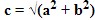

# python-start-course

## Урок 1. Установка Python и Pycharm
### Для установки Python на Windows вам понадобятся следующие шаги:
- Загрузка установщика Python Перейдите на официальный сайт Python и скачайте установщик Python для Windows. Официальный сайт Python: https://www.python.org/downloads/

- Запуск установщика. Запустите загруженный установщик Python и следуйте инструкциям на экране. Убедитесь, что вы выбрали опцию "Add Python to PATH" во время установки, чтобы Python был доступен из командной строки.

- Проверка установки. После завершения установки откройте командную строку и введите команду python --version, чтобы убедиться, что Python успешно установлен.

### Для установки PyCharm на Windows на вашем компьютере, выполните следующие шаги:
- Перейдите на **официальный сайт** PyCharm от JetBrains. Официальный сайт PyCharm от JetBrains: https://www.jetbrains.com/ru-ru/pycharm/download/?section=windows
- Скачайте последнюю версию **PyCharm Community Edition для Windows**.
- Запустите загруженный установщик PyCharm.
- Следуйте инструкциям на экране, чтобы завершить установку. Убедитесь, что вы выбрали правильную версию PyCharm (Community Edition или Professional) в соответствии с вашими потребностями.
- После завершения установки, запустите PyCharm.

### Для создания первого проекта в PyCharm вам потребуется выполнить следующие шаги:
- В меню выберите **"File"** (Файл) и затем **"New Project"** (Новый проект).
- В появившемся окне выберите **местоположение для вашего проекта** и **введите его название**.
- Нажмите кнопку **"Create"** (Создать) для создания проекта.

## Урок 2. Переменные, оператор присваивания, функции type и id
### Типизация
**Типизация** - это концепция, связанная с определением **типов данных в программировании**. Она определяет, **какие типы данных могут быть использованы в языке программирования** и **как эти типы взаимодействуют друг с другом**.

В языках программирования **типизация** может быть **динамической** или **статической**.
- **Динамическая типизация** означает, что **тип** переменной определяется **автоматически** на основе значения, которое ей присваивается.
- **Статическая типизация**, напротив, требует **явного объявления типов переменных** и **проверки их соответствия во время компиляции**.

### Типизация в Python.
В Python используется **динамическая типизация**, что означает, что **тип переменной определяется автоматически** на основе значения, которое ей присваивается. В отличие от языков с явной типизацией, в Python вам не нужно объявлять тип переменной явно.

### Основные компоненты и действия, которые присутствуют в программировании:
- Данные
- Вычисления
- Проверка условий
- Циклы

### Переменные
**Переменная** - это имя, которое используется для хранения значения. Она представляет собой **ссылку на объект в памяти компьютера**. Переменные в Python могут содержать различные типы данных.  
В Python **имена переменных** могут состоять из **букв (как строчных, так и заглавных)**, **цифр** и **символа подчеркивания**.  
**Имя переменной не может начинаться с цифры**.  
Python также является **регистрозависимым языком**, поэтому переменные **myVar**, **myvar** и **MYVAR** будут **считаться разными переменными**.
```python
a = 7
```
- **a** - это имя переменной. 
- **=** - это оператор присваивания. Он позволяет присвоить переменной определенное значение или ссылку на объект.
- **7** - это объект на который ссылается **а**. 

В языке **Python** переменные **не хранят сами объекты**, а лишь **ссылаются** на них с определенными значениями. Это означает, что **одной переменной можно присваивать объекты разных типов данных**. Например, вы можете создать переменную x и присвоить ей значение числа, а затем изменить ее значение, присвоив ей строку или другой объект. В Python переменные являются **ссылками на объекты**, и их значения могут изменяться в процессе выполнения программы.

Например:
```python
x = 10
print(x)  # Вывод: 10

x = "Hello, world!"
print(x)  # Вывод: Hello, world!

x = [1, 2, 3]
print(x)  # Вывод: [1, 2, 3]
```
### Функция id
Каждый объект в Python имеет свой **уникальный идентификатор**, который можно получить с помощью функции **id()**. Идентификатор представляет собой **целое число, которое гарантированно уникально для каждого объекта во время его существования**.

Например:
```python
a = 2
b = a 
c = b
print(id(a)) # Вывод: 140719720362824
print(id(b)) # Вывод: 140719720362824
print(id(c)) # Вывод: 140719720362824
```
**Идентификаторы** у всех трех переменных будут **одинаковы**. Это говорит о том, что эти **три переменные** ссылаються на **один объект**.

### Функция type
Функция **type()** в языке Python используется для получения **типа объекта**. Она возвращает информацию о **типе данных**, к которому принадлежит **объект**.

Например:
```python
x = 5
print(type(x))  # Вывод: <class 'int'>

y = "Hello"
print(type(y))  # Вывод: <class 'str'>

z = [1, 2, 3]
print(type(z))  # Вывод: <class 'list'>
```
## Вопросы:
1. Что представляет собой переменная в Python?
2. Что делает оператор присваивания (=)?
3. Какая типизация реализована в Python?
4. Что происходит при присваивании одной переменной другой (a = b)?
5. Для чего используется функция type?
6. Различаются ли имена переменных arg, Arg, ARG интерпретатором языка Python?
7. Можно ли функции id присвоить число 7 (id = 7)?

## Урок 3. Числа и операции над ними
### Числовые типы данных
В **Python** существуют **различные типы чисел**.  
Вот некоторые из них:
- **Целые числа (int)**: представляют целочисленные значения, например, 0, -1, 100 и т.д.
- **Вещественные числа (float)**: представляют числа с плавающей точкой, такие как 0.5, -3.14, 2.71828 и т.д.
- **Комплексные числа (complex)**: представляются в виде **x + yj**, где **x** и **y** - это **вещественные числа**, а **j** - мнимая единица. Например, **3 + 2j**, **-1.5 + 0.5j** и т.д.

Например:
```python
x = 10  # Целое число
y = 3.14  # Вещественное число
z = 2 + 3j  # Комплексное число

print(type(x))  # <class 'int'>
print(type(y))  # <class 'float'>
print(type(z))  # <class 'complex'>
```
### Операции над типами данных
1. **Сложение (+)**: оператор сложения используется для сложения двух чисел. Например:
```python
x = 5 + 3
print(x)  # Выводит: 8
y = 2
z = 5
res = y + z
print(res) # Выводит: 7
```
2. **Вычитание (-)**: оператор вычитания используется для вычитания одного числа из другого. Например:

```python
y = 10 - 4
print(y)  # Выводит: 6
y = 2
z = 5
res = y - z
print(res) # Выводит -3
```

3. **Умножение (*)**: оператор умножения используется для умножения двух чисел. Например:
```python
z = 2 * 6
print(z)  # Выводит: 12
y = 2
z = 5
res = y * z
print(res) # Выводит 10
```
4. **Деление (/)**: оператор деления используется для деления одного числа на другое. В результате получается число с плавающей точкой (float). Например:
```python
a = 10 / 3
print(a)  # Выводит: 3.3333333333333335
y = 2
z = 5
res = y / z
print(res) # Выводит 0.4
```
5. **Целочисленное деление (//)**: оператор целочисленного деления возвращает целую часть от деления одного числа на другое. Например:
```python
x = 10 // 3
print(x)  # Выводит: 3
y = 2
z = 5
res = y // z
print(res) # Выводит 0
```
6. **Остаток от деления (%)**: оператор остатка от деления возвращает остаток от деления одного числа на другое. Например:
```python
y = 10 % 3
print(y)  # Выводит: 1
y = 2
z = 5
res = y % z
print(res) # Выводит 4
```
7. **Возведение в степень (`**`)**: оператор возведения в степень используется для возведения числа в определенную степень. Например:
```python
z = 2 ** 3
print(z)  # Выводит: 8
y = 2
z = 5
res = y % z
print(res) # Выводит 32
```
### Сокращенная запись операторов
**Сокращенная запись оператора** - это специальный синтаксис, который позволяет выполнять операцию и присваивание значения переменной в одной строке кода.
```python
x = 5
x += 3
print(x)  # Выводит: 8
```
Сокращенную запись оператора можно использовать с любым из семи перечисленных выше операторов.
## Вопросы:
1. К какому типу данных относится int?
2. К какому типу данных относится float?
3. Как называется оператор **`+`**
4. Как называется оператор **`-`**
5. Как называется оператор **`*`**
6. Как называется оператор **`/`**
7. Как называется оператор **`//`**
8. Как называется оператор **`%`**
9. Как называется оператор **`**`**
10. Что выведит строка `print(a + b)`, если a = 7.0, b = 2.5
11. Что выведит строка `print(a ** b)`, если a = 2, b = 4
12. Что выведит строка `print(a / b ** c)`, если a = 32, b = 2, c = 4
13. Что выведит строка `print(a % b)`, если  a = 11, b = 3
14. Что выведит строка `print(a // b)`, если a = 21, b = 4
15. Какой тип данных мы увидим, выполнив строчку `print(type(8/2))`
16. Чему будет равно k?
```python
k = 8
k *= 2
print(k)
```
17. Чему будет равно i?
```python
i = 2
i += 3
print(i)
```

## Урок 4. Математические функции. Модуль math. Функции print() и input()
В языке Python есть множество **встроенных математических функций**, которые могут быть использованы для выполнения различных вычислений.  
Вот некоторые из них:
1. **`abs(x)`**: возвращает абсолютное значение числа **x**.
```python
x = abs(-5)
print(x)  # Выводит: 5
```
2. **`round(x)`**: округляет число x до **ближайшего целого значения**.
```python
x = round(3.7)
print(x)  # Выводит: 4
```
3. **`max(x1, x2, ...)`**: возвращает **наибольшее значение** из переданных аргументов.
```python
x = max(5, 3, 8)
print(x)  # Выводит: 8
```
4. **`min(x1, x2, ...)`**: возвращает **наименьшее значение** из переданных аргументов.
```python
x = min(5, 3, 8)
print(x)  # Выводит: 3

```
5. **`pow(x, y)`**: возвращает значение **x в степени y**.
```python
x = pow(2, 3)
print(x)  # Выводит: 8
```
6. **`sum(iterable)`**: возвращает **сумму всех элементов** в итерируемом объекте.
```python
x = sum([1, 2, 3, 4, 5])
print(x)  # Выводит: 15
```
### Молуль math
Модуль **math** в Python предоставляет **функции для выполнения математических операций**. Чтобы импортировать модуль math, вы можете использовать следующую конструкцию:
```python
import math
```
После импорта модуля math вы можете **использовать его функции** для выполнения различных математических операций.  
Некоторые математические операции модуля math:
1. **`math.sqrt(x)`**: возвращает **квадратный корень** числа x.
```python
import math

x = math.sqrt(16)
print(x)  # Выводит: 4.0
```
2. **`math.pow(x, y)`**: возвращает **значение x в степени y**.
```python
import math

x = math.pow(2, 3)
print(x)  # Выводит: 8.0
```
3. **`math.ceil(x)`**: **округляет число** x вверх **до ближайшего целого значения**.
```python
import math

x = math.ceil(3.2)
print(x)  # Выводит: 4
```
4. **`math.floor(x)`**: **округляет число** x **вниз до ближайшего целого значения**.
```python
import math

x = math.floor(3.8)
print(x)  # Выводит: 3
```
5. **`math.radians(x)`**: **преобразует угол из градусов в радианы**.
```python
import math

x = math.radians(90)
print(x)  # Выводит: 1.5707963267948966
```
6. **`math.sin(x)`**, **`math.cos(x)`**, **`math.tan(x)`**: возвращают синус, косинус и тангенс угла x (в радианах).
```python
import math

x = math.sin(math.radians(90))
print(x)  # Выводит: 1.0
```
7. `math.log(x, base)`: возвращает **логарифм числа x по указанному основанию base**.
```python
import math

x = math.log(10, 2)
print(x)  # Выводит: 3.3219280948873626
```
8. `math.log10(x)`: **возвращает десятичный логарифм числа x**.
```python
import math

x = math.log10(100)
print(x)  # Выводит: 2.0
```
9. `math.factorial(x)`: возвращает факториал числа x.
```python
import math

x = math.factorial(5)
print(x)  # Выводит: 120
```
### Функция print()
- Функция **print()** используется для **вывода текста или значений переменных на экран**.
- Она может **принимать один или несколько аргументов**, разделенных запятыми.
- Аргументы могут быть **строками, числами или другими объектами**, которые могут быть преобразованы в строку.
- Функция print() **автоматически добавляет символ новой строки (\n)** в конце вывода, но это поведение можно изменить с помощью аргументов **end** и **sep**.  
**Примеры использования**:
```python
x = 17
print("Привет, мир!")  # Выводит строку "Привет, мир!"
print(42)  # Выводит число 42
print("Значение переменной x:", x)  # Выводит значение переменной x
```

### Функция input():
- Функция input() используется для получения ввода от пользователя.
- Она может принимать необязательный аргумент - строку, которая будет отображаться перед ожиданием ввода.
- Функция input() возвращает введенное пользователем значение в виде строки.
**Пример использования**:
```python
name = input("Введите ваше имя: ")
print("Привет, " + name + "!")  # Выводит приветствие с именем пользователя
```
## Задание:
1. Допишите текст программы. Выведите в консоль все переменные в одну строчку с помощью одной функции print().
```python
x = 2
y = 5
z = 12
# продолжите программу
```
2. Допишите текст программы. Выведите в консоль все переменные в три строчки с помощью одной функции print().
```python
x = 2
y = 5
z = 12
# продолжите программу
```
3. Допишите текст программы. Выведите в консоль все переменные через пробел используя две функции **print()**.
```python
x = "Привет,"
y = "Мир"
# продолжите программу
```
4. Создать три переменные в которые по очереди будут присваиваться разные слова. Вывести эти слова через запятую используя один print(). 

5. Допишите текст программы. Выведите в консоль модуль значения переменной `d` в консоль.
```python
d = int(input())
# продолжите программу
```
6. Допишите текст программы. Выведите в консоль минимальное значение из созданных переменых.
```python
a = 1
b = 3
c = 45
d = 12
e = 0
# продолжите программу
```
7. Допишите текст программы. Выведите в консоль максимальное значение из созданных переменых.
```python
a = 1
b = 3
c = 45
d = 12
e = 0
# продолжите программу
```
8. Выведите в консоль значение гипотенузы треугольника, если катеты равны a = 3, b = 4.  
Формула гипотенузы:

9. В лагерь нужно отвезти 40 детей и 5 вожатых с помощью автобусов. Максимальная вместимость автобуса 20 человек. Напишите программу для вычисления минимального числа автобусов. Результат (целое число) выведите в консоль.
10. Геливая ручка стоит 20 рублей. Магазин предоставляет скидку в 10% на каждую купленную ручку. Какое количесвто ручек можно будет купить на 500 рублей. Результат (целое число) выведите в консоль.

## Урок 5. Логический тип Bool. Операторы сравнения
**Логический тип bool** в языке программирования Python используется для представления **логических значений** и имеет два возможных значения: **True (истина)** и **False (ложь)**.
### Операторы сравнения
- В Python существуют **операторы сравнения**, которые позволяют **сравнивать значения** и **возвращать логический результат**.
- Операторы сравнения в Python включают:
  - `== (равно)`;
  - `!= (не равно)`; 
  - `> (больше)`; 
  - `< (меньше)`;
  - `>= (больше или равно)`;
  - `<= (меньше или равно)`.
- Результатом оператора сравнения является логическое значение True или False.
```python
a = int(input())
b = int(input())
print(a == b)
print(a > b)
print(a <= b)
```

### Преобразование в логический тип:
- В Python можно преобразовать **другие типы данных** в **логический тип с помощью функции bool()**.
- Значения, которые преобразуются в **False**, включают **пустые строки, числа равные нулю, пустые контейнеры (списки, кортежи, словари) и значение None**.
```python
a = None
b = ""
d = 0

print(bool(a)) # False
print(bool(b)) # False
print(bool(d)) # False
```
- Все остальные значения преобразуются в True.
```python
a = "Строка"
c = 1

print(bool(a)) # True
print(bool(c)) # True
```
### Операторы `and` `or` `not`
Операторы `and`, `or` и `not` в языке программирования Python используются для выполнения логических операций и манипуляций с логическими значениями.
- Оператор `and` выполняет **логическое "и"** между двумя операндами. Он возвращает **True, если оба операнда являются истинными**, и **False в противном случае**.
- Оператор `or` выполняет **логическое "или"** между двумя операндами. Он возвращает **True, если хотя бы один из операндов является истинным**, и **False в противном случае**.
- Оператор `not` выполняет **логическое отрицание операнда**. Он возвращает **True, если операнд является ложным**, и **False, если операнд является истинным**.
```python
x = 5
y = 10

print(x > 0 and y > 20)  # Выводит False
print(x > 0 or y > 20)  # Выводит True
print(not x > 0)  # Выводит False
```
### Приоритет операторов
**Приоритет операторов** определяет порядок выполнения операций в выражениях.
#### Таблица приоритетов операторов:
1. `**` - оператор возведения в степень имеет самый высокий приоритет.
2. `*, /, //, %` - операторы умножения, деления, целочисленного деления и остатка от деления имеют одинаковый приоритет и выполняются слева направо.
3. `+, -` - операторы сложения и вычитания также имеют одинаковый приоритет и выполняются слева направо.
4. `<, >, <=, >=` - операторы сравнения имеют одинаковый приоритет и выполняются слева направо.
5. `==, !=` - операторы равенства и неравенства имеют одинаковый приоритет и выполняются слева направо.
6. `not` - оператор логического отрицания выполняется перед операндом.
7. `and` - оператор логического И выполняется слева направо.
8. `or` - оператор логического ИЛИ выполняется слева направо.

## Задание:
1. Какой результат (True или False) будет получен при выполнении команды `print(10 < 10)`?
2. Какой результат (True или False) будет получен при выполнении команды `print(10 <= 10)`?
3. Допишите текст программы. `a` - это вещественное число (с плавающей точкой). Программа должна выводит True, если целая часть числа `a` кратна трём, и False если не кратна.
```python
a = 78,34
# продолжите программу
```
4. Допишите текст программы. `x` - это стоимость книги. Определите является ли дробное значение (число после запятой) больше 50. В консоль вывести True если больше и False если нет.
```python
x = 435.78
# продолжите программу
```
5. Допишите текст программы. `a, b, c` - предполагаемые длины сторон треугольника. Определите, действительно ли треугольник с такими сторонами может существовать (Сумма длин двух произвольных сторон всегда должна быть больше третьей стороны)? В консоль вывести True, если треугольник формируется и False - в противном случае.
```python
a = 8
b = 11
c = 12
# продолжите программу
```
## Урок 6. Введение в строки. Операции над строками.
### Строка
**Строка** в языке Python представляет собой **последовательность символов, заключенных в одинарные (') или двойные (") кавычки**. Строки могут содержать **любые символы, включая буквы, цифры, специальные символы и пробелы**. Они используются для **хранения и манипуляции текстовой информацией в программе**.
```python
s1 = 'Привет, мир!'
s2 = "Hello, world!"
```
**Многострочные строки** задаются с помощью тройных одинарных (''') или тройных двойных (""") кавычек.  
Например:
```python
s3 = '''
Это строка 1.
Это строка 2.
'''
print(s3)
```
Если мы попробуем отобразить эту строку в консоли Python, то увидим, что наши строки разделены специальным символом:
```
'\nЭто строка 1.\nЭто строка 2.\n'
```
Символ строки `\n` представляет собой **управляющую последовательность, которая обозначает перенос на новую строку**. При выводе строки, если встречается символ \n, текст переносится на новую строку.  
Например:
```python
s4 = "Это строка 1.\nЭто строка 2."
print(s4)
```
Строка так же может вообще не содержать символов - это будет пустая строка.
```python
s = ""
print(s)
```
### Базовые операции над строками
**Базовые операции** над строками включают `конкатенацию (объединение)` строк с помощью оператора `+` и `повторение строки` с помощью оператора `*`.
- `Оператор +` используется для конкатенации (соединения) строк. Он позволяет объединить две строки в одну.  
Например:
```python
s5 = "Привет, " + "мир!"
print(s5)  # Выводит "Привет, мир!"
```
- `Оператор *` в языке Python используется для дублирования строкового фрагмента. Он позволяет повторить строку несколько раз.  
Например:
```python
s6 = "spam" * 3
print(s6)  # Выводит "spamspamspam"
```
### Преобразование в строку
**Функция** `str()` используется для **преобразования аргумента в строковое представление**. Она принимает аргумент **любого типа данных** и **возвращает его строковое представление**.  
Например:
```python
num = 42
s7 = "The answer is: " + str(num)
print(s7)  # Выводит "The answer is: 42"
```
### Вычисление длины строки
**Функция** `len()` используется для **вычисления длины строки**. Она принимает **строку в качестве аргумента** и **возвращает количество символов в строке**.  
Например:
```python
s8 = "Hello, world!"
length = len(s8)
print(length)  # Выводит 13
```
### Оператор для проверки вхождения подстроки в строку
**Оператор** `in` в языке Python используется для **проверки вхождения подстроки в строку**. Он возвращает логическое значение `True`, если **подстрока присутствует в строке**, и `False` в **противном случае**.  
Например:
```python
s9 = "Hello, world!"
print("world" in s9)  # Выводит True
print("foo" in s9)  # Выводит False
```
### Сравнение строк
Операторы сравнения `(==, !=, >, <, >=, <=)` используются для **сравнения строк**. Они сравнивают строки лексикографически (по алфавиту) и возвращают логическое значение True или False.  
При **лексикографическом сравнении строк** происходит сравнение символов в строках **по их порядку в таблице символов**. Сравнение начинается с первого символа каждой строки и продолжается до тех пор, пока не будет найдено отличие или одна из строк не закончится.
**Алгоритм сравнения**:
- Сравниваются первые символы обеих строк. Если они различаются, то строка с меньшим символом считается "меньшей" в лексикографическом порядке. Например, строка "apple" будет меньше строки "banana", потому что символ "a" имеет меньший код ASCII, чем символ "b".
- Если первые символы совпадают, то сравниваются следующие символы в обеих строках. Процесс продолжается до тех пор, пока не будет найдено отличие или одна из строк не закончится.
- Если одна строка заканчивается, а другая продолжает иметь символы, то строка, которая закончилась, считается "меньшей" в лексикографическом порядке. Например, строка "apple" будет меньше строки "applesauce".
- Если обе строки заканчиваются одновременно и не было найдено отличий, то строки считаются равными.
Например:
```python
str1 = "apple"
str2 = "banana"
print(str1 < str2)  # Выводит True

str3 = "apple"
str4 = "applesauce"
print(str3 < str4)  # Выводит True

str5 = "apple"
str6 = "apple"
print(str5 == str6)  # Выводит True
```
### Таблица символов
**Таблица символов** в Python основана на стандарте Unicode, который определяет уникальный числовой код для каждого символа. Коды символов в таблице Unicode могут быть представлены в различных кодировках, таких как ASCII.

В Python для определения кода **ASCII** символа используется функция `ord()`. Она принимает символ в качестве аргумента и возвращает его числовое значение в кодировке ASCII.  
Например:
```python
char = 'A'
ascii_code = ord(char)
print(ascii_code)  # Выводит 65
```
## Задание
1. В каких кавычках можно задать строки?
2. В каких кавычках можно задать многострочные строки?
3. Как обозначается символ переноса на новую строку?
4. Что будет выведено в консоль при выполнении команды: `print( (1+2)*('7'+'8') )`
5. Допишите текст программы. Есть две строки s1 и s2. Необходимо сформировать новую строку, продублировав первое слово дважды, а второе - трижды и вывести результат на экран.
```python
s1 = "hello"
s2 = "python"
# продолжите программу
```
6. Допишите текст программы. Есть две переменные a и b. Необходимо сформировать строку вида: `Переменная a = <значение>, переменная b = <значение>` и вывести на экран.
```python
a = 12
b = 7
# продолжите программу
```
7. Допишите текст программы. Есть переменная s3, которая является строкой. Необходимо сформировать новую строку вида: `Строка: <введенная строка>. Длина: <длина строки>` и вывести ее на экран.
```python
s3 = "Hello, Python!"
# продолжите программу
```
8. Допишите текст программы. Есть две переменные s4 и s5. Необходимо вычислить следующие булевы значения:
- проверка вхождения первого слова во второе
- сравнение двух слов
- сравнение на **больше** первого слова со вторым
- сравнение на меньше первого слова со вторым
Вывести результаты на экран одной строкой.
```python
s4 = "str"
s5 = "fivestr"
# продолжите программу
```
9. Допишите текст программы. Есть две переменные char1 и char2. Необходимо сформировать строку вида: `Коды: <буква1> = <код буквы1>, <буква2> = <код буквы2>` и вывести ее на экран.
```python
char1 = "a"
char2 = "z"
# продолжите программу
```

## Урок 7. Индексы и срезы строк.

### Индексы в строке
Строка представляет собой **последовательность символов**, заключенных в одинарные или двойные кавычки.  
Каждый символ строки имеет свой **уникальный, порядковый номер**. Эти номера называются **индексами**.  
**Индексы строки** используются для обращения к **отдельным символам в строке**.  
**Индексы** начинаются с **0** для первого символа, 1 для второго символа и так далее.  
**Отрицательные индексы** могут быть использованы для обращения к символам с конца строки, где -1 обозначает последний символ, -2 обозначает предпоследний символ и так далее.
```python
my_string = "Hello, World!"
first_char = my_string[0]  # Получаем первый символ "H"
last_char = my_string[-1]  # Получаем последний символ "!"
```
Если вы попытаетесь обратиться к **несуществующему индексу** строки в Python, возникнет **ошибка IndexError**.  
Это происходит, когда индекс находится за пределами допустимого диапазона индексов строки.
```python
my_string = "Hello, World!"
invalid_index = my_string[100]  # Попытка получить символ с несуществующим индексом
```
### Подстроки. Срезы.
**Подстрока** - это часть строки, которая состоит из **последовательности символов**.  
**Подстрока** может быть получена путем **выбора определенного диапазона символов из исходной строки**.
Для **выделения подстроки** в Python можно использовать **срезы строк**.  

**Срезы строк** позволяют получать **подстроки из исходной строки**.  
Синтаксис срезов состоит из использования **квадратных скобок** и **двоеточия**.  

**Срезы строк** включают:
- **начальный индекс(start)**,
- **конечный индекс(stop)**,
- **шаг(step)**.  

Синтаксис срезов:
```
string[start:stop:step]

start - индекс, с которого начинается срез (включительно).
stop - индекс, на котором заканчивается срез (не включается).
step - шаг, определяющий, какие символы будут включены в срез.
```

Пример использования **срезов**:
```python
main_string = "Python is fun!"
substring = main_string[0:6]  # Получаем подстроку "Python"
substring2 = main_string[7:]  # Получаем подстроку "is fun!"
substring3 = main_string[:6]  # Получаем подстроку "Python is fun"
substring4 = main_string[::2]  # Получаем подстроку "Pto sfn"
```
### Отрицательный шаг в срезах.
**Отрицательный шаг** в срезах используется для получения подстроки в **обратном порядке**. Отрицательный шаг указывает, **какие символы будут включены в подстроку**.

Например:
```python
main_string = "Привет, мир!"
reversed_string = main_string[::-1]  # Получаем строку в обратном порядке "!рим ,тевирП"
substring1 = main_string[4:1:-1]  # Получаем подстроку "ети"
substring2 = main_string[::-2] # Получаем каждый второй символ в обратном порядке
substring3 = main_string[1:4:-1] # Получаем пустую строку
print("reversed_string: ", reversed_string)
print("substring1: ", substring1)
print("substring2: ", substring2)
print("substring3: ", substring3)
```
### Почему при `main_string[4:1:-1]` получаем подстроку "ети", а при `main_string[1:4:-1]` получаем пустую строку?
Отрицательный шаг в срезах указывает направление обхода символов строки. 
В данном случае, `main_string[4:1:-1]` означает, что мы начинаем с индекса **4 (символ "е")**, заканчиваем на индексе **1 (символ "и")** и двигаемся с **шагом -1 (в обратном направлении)**.  
Мы получаем подстроку "ети".  
Если бы мы использовали `main_string[1:4:-1]`, то **начальный индекс (1)** был бы **меньше конечного индекса (4)**, что **противоречит направлению обхода**. В результате получилась **пустая строка**.

Таким образом, срезы всегда должны образовывать **диапозон значений**.

### Изменение строк.
Cтроки являются **неизменяемым типом данных**, что означает, что непосредственное изменение строки невозможно.  
Попытка **изменить символ** по индексу или **присвоить символ новому индексу** строки приведет к ошибке:
```python
main_string = "Hello World!" # Длина строки - 12 символов, т.е. последний символ имеет индекс "11"
main_string[11] = "?" # Ошибка
main_string[12] = "!" # Ошибка
```
Чтобы изменить строку, нужно **создать новую с другим содержимым**:
```python
main_string = "Hello World!"
second_string = main_string[:-1] + "?"
print(main_string)
print(second_string)
```
## Вопросы:
1. Что такое строка?
2. Как выполняется индексация к отдельным символам строки?
3. Как выделять из строк наборы символов – срезы?
4. Возможно ли изменить строку?
4. Способ модификации (изменения) строк через индексы и срезы.
## Задачи:
1. На вход программе подается строка с помощью input(). Прочитайте эту строку и отобразите на экране ее первый и последний символ подряд в одну строчку.
2. На вход программе подается строка с помощью input(). Прочитайте эту строку и отобразите первые четыре ее символа. Полагается, что строка гарантированно имеет длину не менее четырех символов.
3. На вход программе подается строка с помощью input(). Прочитайте эту строку и отобразите последние три ее символа. Полагается, что строка гарантированно имеет длину не менее трех символов.
4. На вход программе подается строка. Прочитайте ее и отобразите все ее символы с нечетными индексами подряд в одну строчку.
5. На вход программе подаются две строки, каждая с новой строчки. Прочитайте их и из первой строки выделите все символы с четными индексами, а из второй - с нечетными. Объедините полученные строки через пробел и выведите результирующую строку на экран.
6. На вход программе подается строка. Необходимо ее прочитать и отобразить первые пять символов в обратном порядке. Полагается, что введенная строка имеет минимум пять символов.
7. На вход программе подаются две строки, каждая с новой строчки. Длина первого слова меньше второго. Необходимо  обрезать второе слово до длины первого и вывести на экран.


## Урок 8. Основные методы строк.
### Методы строк.
**Методы** - это **функции**, которые применяются к объектам **определенного типа данных**.
**Методы строк** - это специальные **функции**, которые могут быть применены к строковым объектам для выполнения **различных операций**.
Чтобы **вызвать метод** для конкретной строки, необходимо **указать объект**, **поставить точку**, **записать имя метода** и в **круглых скобках список аргументов**, если они необходимы:
```
объект.метод(аргументы)
```
### Основные методы строк:
- `String.upper()` - Возвращает строку с заглавными буквами.
```python
s = 'hello'
uppercase = s.upper()
print(uppercase)  # Вывод: 'HELLO'
```
- `String.lower()` - Возвращает строку с малыми буквами.
```python
s = 'WORLD'
lowercase = s.lower()
print(lowercase)  # Вывод: 'world'
```
- `String.count(sub)` - Определяет число вхождений подстроки в строке.
```python
s = 'hello'
count = s.count('l')
print(count)  # Вывод: 2
```
- `String.find(sub)` - Возвращает индекс первого найденного вхождения. Если подстрока не найдена, метод возвращает значение -1.
```python
s = 'hello'
index = s.find('o')
print(index)  # Вывод: 4
```
- `String.rfind(sub)` - Возвращает индекс первого найденного вхождения при поиске справа.
```python
s = 'hello'
index = s.rfind('l')
print(index)  # Вывод: 3
```
- `String.index(sub)` - Возвращает индекс первого найденного вхождения. Если подстрока не найдена, метод вызывает исключение ValueError.
```python
s = 'hello'
index = s.index('e')
print(index)  # Вывод: 1
```
- `String.replace(old, new)` - Заменяет подстроку old на new.
```python
s = 'hello'
new_string = s.replace('l', 'p')
print(new_string)  # Вывод: 'heppo'
```
- `String.isalpha()` - Определяет, состоит ли строка целиком из буквенных символов.
```python
s = 'hello'
is_alpha = s.isalpha()
print(is_alpha)  # Вывод: True
```
- `String.isdigit()` - Определяет, состоит ли строка целиком из цифр. 
```python
s = '123'
is_digit = s.isdigit()
print(is_digit)  # Вывод: True
```
- `String.rjust(width)` - Расширяет строку, добавляя символы слева. 
```python
s = 'hello'
padded = s.rjust(10)
print(padded)  # Вывод: '     hello'
```
- `String.ljust(width)` - Расширяет строку, добавляя символы справа.
```python
s = 'hello'
padded = s.ljust(10)
print(padded)  # Вывод: 'hello     '
```
- `String.split(sep)` - Разбивает строку на подстроки, используя указанный разделитель. 
```python
s = 'hello,world'
words = s.split(',')
print(words)  # Вывод: ['hello', 'world']
```
- `String.join(список)` - Объединяет коллекцию в строку. 
```python
words = ['hello', 'world']
joined = ' '.join(words)
print(joined)  # Вывод: 'hello world'
```
- `String.strip()` - Удаляет пробелы и переносы строк справа и слева. 
```python
s = '   hello   '
stripped = s.strip()
print(stripped)  # Вывод: 'hello'
```
- `String.rstrip()` - Удаляет пробелы и переносы строк справа.
```python
s = '   hello   '
stripped = s.rstrip()
print(stripped)  # Вывод: '   hello'
```
- `String.lstrip()` - Удаляет пробелы и переносы строк слева.
```python
s = '   hello   '
stripped = s.lstrip()
print(stripped)  # Вывод: 'hello   '
```
## Вопросы:
1. Что возвращает метод **String.upper()**?
2. Что возвращает метод **String.lower()**?
3. Что возвращает метод **String.count()**?
4. Что возвращает метод **String.find()**?
5. Что делает метод **String.replace()**?
6. Что делает метод **String.split()**?
7. Что делает метод **String.join**?
8. Что возвратит метод **String.index()**, если подстрока не будет найдена в строке?
9. Что возвратит метод **String.find()**, если подстрока не будет найдена в строке?

## Задачи:
1. На вход программе подается слово в виде строки. Необходимо прочитать это слово и его первую букву сделать заглавной, а остальные - малыми. Результат отобразить на экране.
2. На вход программе подается строка. Необходимо прочитать эту строку и определить число вхождений дефисов (-) в ней. На экране отобразить полученное число. Пример входящей строки: `osnovnye-metody-strok`.
3. На вход программе подается строка. Прочитайте эту строку и найдите в ней индекс первого вхождения фрагмента "ra". Полученное число (индекс) выведите на экран.
4. На вход программе подается строка. Прочитайте ее и замените в ней все двойные дефисы (--) и тройные (---) на одинарные (-). Подумайте, в какой последовательности следует выполнять эти замены. Результат преобразования выведите на экран. Пример входящей строки: `osnovnye-metody---strok--practica`.
5. На вход программе подаются три целых положительных числа (максимум трехзначные), записанные в одну строчку через пробел. Необходимо их прочитать из входного потока. Затем, для двухзначных и однозначных чисел добавить слева незначащие нули так, чтобы все числа содержали по три цифры. Вывести на экран полученные числа в столбик (каждое с новой строки) в порядке их чтения из входного потока.
6. На вход программе подается строка, состоящая из слов, разделенных пробелом. Необходимо прочитать строку и подсчитать число слов в ней. Результат (число слов) отобразить на экране.
7. На вход программе подается строка, состоящая из названий городов, разделенных пробелом. Необходимо прочитать эту строку и преобразовать так, чтобы названия городов шли через точку с запятой (без пробелов). Результат  (строку) отобразите на экране. Пример строки: `Москва Тверь Казань`

## Урок 9. Экранирование символов. Спецсимволы.
### Специальные символы
**Специальные символы** - это символы, которые имеют **особое значение** и **используются для определенных целей** в строках или коде на языке Python.  
### Экранирование символов.
**Экранирование символов** - это процесс использования **обратной косой черты** `(\)` перед специальными символами, чтобы указать, что они **должны быть интерпретированы как обычные символы, а не как часть синтаксиса языка Python**.  
Это позволяет **использовать символы, которые обычно имеют специальное значение, в строках или коде Python**.
### Список специальных символов в Python:
```
\n -         Перевод строки

\\ -         Символ обратного слеша

\’ -         Символ апострофа

\" -         Символ двойной кавычки

\a -         Звуковой сигнал

\b -         Эмуляция клавиши BackSpace

\f -         Перевод формата

\r -         Возврат каретки

\t -         Горизонтальная табуляция (размером в 4 пробела)

\v -         Вертикальная табуляция

\0 -         Символ Null (не признак конца строки)

\xhh -       Символ с шестнадцатиричным кодом hh

\ooo -       Символ с восьмиричным кодом ooo

\N{id} -     Идентификатор из кодовой таблицы Unicode

\uhhhh -     16-битный символ Unicode в шестнадцатиричной форме

\Uhhhhhhhh - 32-битный символ Unicode в шестнадцатиричной форме

\другое -    Не является экранированной последовательностью
```
## Наиболее распространенные специальные символы:
- `\n` - символ новой строки
- `\t` - символ табуляции
- `\"` - двойная кавычка
- `\'` - одинарная кавычка
- `\\` - обратная косая черта

## Явное указание специальных символов
**Специальные символы** в Python могут быть указаны с помощью **обратной косой черты** `(\)`.
### Примеры:
1. Символ новой строки `(\n)`:
```python
print("Привет,\nмир!")
```
2. Символ табуляции `(\t)`:
```python
print("Имя:\tДжон")
```
3. Двойная кавычка `(\")`:
```python
print("Он сказал: \"Привет!\"")
```
4. Одинарная кавычка (\'):
```python
print('Она сказала: \'Привет!\'')
```
5. Обратная косая черта (\\):
```python
print("Путь к файлу: C:\\папка\\файл.txt")
```
6. Символ возврата каретки (\r). :
```python
print("Привет,\rмир!")
```
7. Символ возврата на одну позицию назад. Эмуляция клавиши BackSpace (\b):
```python
print("Привет\bмир!")
```
8. Символ перевода страницы (\f):
```python
print("Заголовок\n\nТекст\fПодзаголовок")
```
**Дополнение**:  
`Возврат каретки (\r)` - это специальный символ в Python, который обозначает **перевод каретки в начало текущей строки**.  
При использовании этого символа, **курсор перемещается в начало строки, и последующий вывод замещает уже существующий текст** на этой строке.  
Например, если вы используете символ `\r` в строке вывода, то **следующий текст будет начинаться с начала строки, перезаписывая предыдущий текст** на этой строке.  
Это может быть полезно, например, при **создании анимаций в терминале или обновлении прогресс-бара**.  
**Пример использования**:
```python
import time

for i in range(10):
    print(f"Прогресс: {i}/10", end="\r")
    time.sleep(1)
```

## Сырые строки в Python.
**Сырые строки** - это строки, в которых **специальные символы не интерпретируются и остаются в их исходном виде**. Они задаются с помощью префикса `r` **перед открывающей кавычкой строки**.  
### Примеры:
- **Избегание экранирования специальных символов**: В сырых строках специальные символы, такие как обратная косая черта `(\)`, не экранируются.  
Это может быть полезно, например, **при работе с путями файлов в операционной системе Windows**, где обратная косая черта используется в путях файлов.  
**Пример**:
```python
path = r'C:\Users\Username\Documents\file.txt'
print(path)
```
- **Удобное использование регулярных выражений**: Регулярные выражения часто содержат специальные символы, которые могут быть интерпретированы в обычных строках.  
Использование сырых строк позволяет избежать необходимости экранирования специальных символов в регулярных выражениях.  
**Пример**:
```python
import re
pattern = r'\d+'  # Ищем одну или более цифр
```
- **Сохранение форматирования**: Сырые строки также сохраняют все пробелы и отступы, что может быть полезно, например, при создании многострочных текстовых блоков или сохранении форматирования в SQL-запросах.  
**Пример**:
```python
query = r'''
SELECT *
FROM table
WHERE condition = 'value'
'''
```
## Вопросы:
1. Что такое спецсимволы?
2. Что такое экранирование символов?
3. Какие основные спецсимволы для строк существуют?
4. Как определяются сырые строки?
5. Символ `Перевод строки`
6. Символ `Обратного слеша`
7. Символ `Апострофа (одинарной кавычки)`
8. Символ `Двойной кавычки`
9. Символ `Эмуляции клавиши BackSpace`
10. Символ `Возврат каретки`
11. Символ `Горизонтальная табуляция`

## Задачи:
1. Задать строку со следующим содержимым: `Тема занятия "спецсимволы"`. Вывести ее на экран.
2. На вход программе подается строка, состоящая из двух слов, записанных в одну строчку через пробел. Необходимо прочитать строку и между словами поставить символ обратного слеша (вместо пробела). Результирующую строку отобразите на экране.
3. На вход программе подается строка со словами, разделенными пробелами (один пробел между соседними словами). В строке может присутствовать от одного и более слов. Необходимо прочитать строку и первый пробел (если он есть) заменить на одинарную кавычку, а все остальные - на двойные. Результирующую строку вывести на экран.
4. Используя raw-строки, задайте строку, содержащую путь к файлу "main.py" вашего проекта. Выведите эту строку на экран.
5. На вход программе подается слово в виде строки. Необходимо прочитать его и сформировать новую строку, где введенное слово будет заключено в двойные кавычки. Результат вывести на экран.

## Урок 10. Форматирование строк и F-строки
### Форматирование и Формирование строк.
**Форматирование строк** в Python относится к процессу **создания строки, в которой значения переменных вставляются в определенные места с использованием заполнителей**.  
Это позволяет контролировать **формат вывода и вставлять значения различных типов данных в строку**.  
В Python существует несколько способов форматирования строк, таких как метод `format()` и `f-строки (f-strings)`.

**Формирование строк** в Python относится к процессу **создания строки путем объединения нескольких значений или переменных**.  
Это может быть достигнуто с помощью `оператора конкатенации (+)` или `метода join()`.

C `оператором конкатенации (+)` и `методом join()` мы уже знакомы.

### Способы Форматирования строк.
1. **Использование метода `format()`**:  
Метод **format()** позволяет вставлять значения переменных в строку, используя заполнители {}.  
**Например**:
```python
name = "John"
age = 25
message = "Меня зовут {} и мне {} лет.".format(name, age)
```
2. **Использование `f-строк (f-strings)`**:  
**F-строки** - это новый способ форматирования строк, доступный в Python 3.6 и выше.  
Они позволяют вставлять значения переменных непосредственно в строку, используя выражение в фигурных скобках `{}`.  
**Например**:
```python
name = "John"
age = 25
message = f"Меня зовут {name} и мне {age} лет."
```

## Задачи:
1. На вход программе подаются (каждое с новой строки) следующие данные:
- имя (строка);
- фамилия (строка);
- возраст (целое положительное число).  
Необходимо прочитать эти данные и, используя строковый метод format, сформировать новую строку по шаблону:
`Уважаемый <имя> <фамилия>! Поздравляем Вас с <возраст>-летием!`
Результат (строку) вывести на экран (без кавычек).
2. На вход программе подаются габариты изделия (целые числа): ширина, глубина, высота, записанные в одну строчку через пробел. Необходимо прочитать эти числа и с помощью метода format, используя ключи в качестве имен переменных, сформировать строку по шаблону:
`Габариты: <ширина> x <глубина> x <высота>`
Полученную строку вывести на экран (без кавычек).
3. На вход программе подаются два целых числа, записанных в одну строку через пробел. Необходимо прочитать эти числа и сформировать новую F-строку со значениями прочитанных чисел, записанных по возрастанию через пробел. Полученную строку вывести на экран.
4. На вход программе подаются следующие данные (каждое с новой строки):
- курс доллара (вещественное значение);
- число рублей (целое число) для обмена рублей на доллары.  
Необходимо прочитать эти данные и вычислить целое количество получаемых долларов (с отбрасыванием дробной части) и сформировать строку, по шаблону:
`Вы можете получить <долларов>$ за <число рублей> рублей по курсу <курс доллара>`. 
Вывести полученную строку на экран (без кавычек).

## Урок 11. Списки. Операторы и функции работы со списками
### Список. Тип данных.
**Списки** - это **упорядоченные коллекции элементов**, которые могут содержать объекты **разных типов**.
Они являются **изменяемыми типами данных**, что означает, что их элементы могут быть изменены после создания списка.
Списки используются **для хранения и манипулирования наборами данных**,  
а также для выполнения различных операций, таких как **добавление, удаление и доступ к элементам списка**.

**Примеры использования списков в Python:**
- Хранение списка студентов в классе:
```python
students = ['Анна', 'Иван', 'Мария']
```
- Хранение координат точек на плоскости:
```python
points = [(0, 0), (1, 2), (3, 4)]
```
- Хранение результатов эксперимента:
```python
results = [10.2, 8.7, 9.5, 11.1]
```
### Как задавать список
В Python есть несколько способов задать список:
- Задание списка с помощью квадратных скобок и перечисления элементов через запятую:
```python
my_list = [1, 2, 3, 4, 5]
```
- Задание пустого списка:
```python
empty_list = []
```
- Задание списка с помощью функции list():
```python
my_list = list('hello')
```
Задание списка с использованием генератора списка:
```python
my_list = [x for x in range(10)]
```
- Задание списка с помощью метода append():
```python
my_list = []
my_list.append(1)
my_list.append(2)
my_list.append(3)
```

### Список - изменяемый тип даных
**Списки** в Python являются изменяемыми типами данных, что означает, что их **элементы могут быть изменены после создания списка**. Это отличает их от неизменяемых типов данных, таких как строки или кортежи.

**Примеры:**
- Пример изменения элемента списка:
```python
my_list = [1, 2, 3, 4, 5]
my_list[0] = 10
```
- Пример удаления элемента из списка:
```python
my_list = [1, 2, 3, 4, 5]
del my_list[2]
```
- Пример добавления элемента в список:
```python
my_list = [1, 2, 3, 4, 5]
my_list.append(6)
```
### Функции для работы со списками
- `len()` – **определение числа элементов в списке (длина списка)**:
```python
my_list = [1, 2, 3, 4, 5]
length = len(my_list)
print(length)  # Вывод: 5
```
- `max()` – **для нахождения максимального значения**:
```python
my_list = [1, 2, 3, 4, 5]
maximum = max(my_list)
print(maximum)  # Вывод: 5
```
- `min()` – **для нахождения минимального значения**:
```python
my_list = [1, 2, 3, 4, 5]
minimum = min(my_list)
print(minimum)  # Вывод: 1
```
- `sum()` – **для вычисления суммы**:
```python
my_list = [1, 2, 3, 4, 5]
total = sum(my_list)
print(total)  # Вывод: 15
```
- `sorted()` – **для сортировки коллекции**:
```python
my_list = [5, 2, 4, 1, 3]
sorted_list = sorted(my_list)
print(sorted_list)  # Вывод: [1, 2, 3, 4, 5]
```
### Операторы списков
- `+` – **соединение двух списков в один**
```python
list1 = [1, 2, 3]
list2 = [4, 5, 6]
combined_list = list1 + list2
print(combined_list)  # Вывод: [1, 2, 3, 4, 5, 6]
```
- `*` – **дублирование списка**:
```python
my_list = [1, 2, 3]
duplicated_list = my_list * 2
print(duplicated_list)  # Вывод: [1, 2, 3, 1, 2, 3]
```
- `in` – **проверка вхождения элемента в список**:
```python
my_list = [1, 2, 3, 4, 5]
if 3 in my_list:
    print("Элемент 3 присутствует в списке")
```
- `del` – **удаление элемента списка**:
```python
my_list = [1, 2, 3, 4, 5]
del my_list[2]
print(my_list)  # Вывод: [1, 2, 4, 5]
```

## Вопросы:
1. К каким типам данных относится список?
2. С помощью какой конструкции или функции можно задавать список?
3. По какому индексу можно обратиться к значению 5 списка: `a = [0, True, "Москва", 5, False, "Омск"]`
4. Что делает оператор `+` при использовании со списками?
5. Что делает оператор `*` при использовании со списками?
6. Что делает оператор `in` при использовании со списками?
7. Что делает оператор `del` при использовании со списками?

## Задачи:
1. На вход программе подаются три целых числа. Необходимо прочитать эти числа и сформировать список lst, хранящий прочитанные значения в порядке их чтения. Результат (список) выведите на экран, используя команду: `print(lst)`.
2. На вход программе подается строка с названиями городов, записанных в одну строчку через пробел. Необходимо прочитать эту строку и на ее основе сформировать список. Затем, необходимо проверить, присутствует ли в этом списке город "Москва". Вывести на экран True, если присутствует и False - в противном случае.
3. На вход программе подается строка с названиями городов, записанных в одну строчку через пробел. Сформируйте список из этой строки. Выведите значение последнего элемента списка на экран.
4. На вход программе подается строка с оценками студента, записаными через пробел. Необходимо вычислить средний балл списка и вывести его на экран с точностью до десятых.
5. На вход программе подаются следующие данные по книге (каждое значение с новой строки):
- название (строка);
- автор (строка);
- число страниц (целое число);
- цена (вещественное число).  
Необходимо прочитать эти данные и сохранить в списке в порядке их чтения.  
Затем, из этого списка удалить 3-й элемент (число страниц)
в качестве автора записать "Пушкин"  
цену увеличить в 2 раза.  
Результат вывести на экран:
6. На вход программе подается строка с числами новых подписчиков канала по дням, записанных в одну строку через пробел. Необходимо прочитать эти числа и сохранить в списке, как целые числа в порядке их следования в строке. Затем, вывести через пробел на экран максимальное, минимальное и суммарное значения этого списка.
7. На вход программе подается строка с числами новых подписчиков канала по дням, записанных в одну строку через пробел. Необходимо прочитать эти числа и сохранить в списке, как целые числа в порядке их следования в строке. Затем, отсортировать элементы этого списка по убыванию и результат вывести на экран.
8. На вход программе подается строка, содержащая названия городов, записанных через пробел. Необходимо прочитать эту строку и на ее основе создать список lst из названий городов, добавив в его начало список cities: cities = ["Москва", "Тверь", "Вологда"]. Выведите полученный список lst на экран.

## Урок 12. Срезы списков. Сравнение списков
### Срезы списка
**Срез списка** - это операция, которая позволяет получить подсписок из исходного списка.  
Срез определяется с помощью указания **начального** и **конечного индексов** элементов списка, которые нужно включить в подсписок.
Синтаксис среза списка выглядит следующим образом:
```
список[начало:конец:шаг]
```
При этом **элемент с индексом начала включается в подсписок**, а **элемент с индексом конца не включается**.
**Примеры использования срезов списков**:  
```python
numbers = [0, 1, 2, 3, 4, 5, 6, 7, 8, 9]

# Пример среза с двумя аргументами
sublist1 = numbers[2:5]
print(sublist1)  # [2, 3, 4]

# Пример среза с тремя аргументами
sublist2 = numbers[1:8:2]
print(sublist2)  # [1, 3, 5, 7]
```
### Изменение списка с помощью среза
Срез списка позволяет выбирать определенные элементы списка и изменять их значения.
```python
numbers = [1, 2, 3, 4, 5]
numbers[1:4] = [10, 20, 30]
print(numbers)  # [1, 10, 20, 30, 5]
```
В некоторых случаях можно словить ошибку при попытке изменить список с помощью срезов:
- **Индекс выходит за границы списка**:  
Если указанный индекс в срезе выходит за границы списка, то возникает ошибка IndexError.  
Например, если список содержит 5 элементов, а вы пытаетесь изменить срез с индексами от 3 до 10, то возникнет ошибка IndexError.

### Сравнение списков.
Сравнение списков в Python выполняется с помощью операторов сравнения, таких как `==, !=, <, >, <= и >=`.
- Оператор `==` используется для проверки равенства двух списков. Если все элементы исходных списков равны и имеют одинаковый порядок, то результатом будет True, в противном случае - False.
- Оператор `!=` используется для проверки неравенства двух списков. Если хотя бы один элемент отличается или порядок элементов различается, то результатом будет True, в противном случае - False.
- Операторы `<, >, <= и >=` используются для сравнения списков в лексикографическом порядке. Сравнение выполняется покомпонентно, начиная с первого элемента. Если первый отличающийся элемент в первом списке меньше (или больше) соответствующего элемента во втором списке, то результатом будет True, в противном случае - False.
```python
list1 = [1, 2, 3]
list2 = [1, 2, 3]
list3 = [4, 5, 6]

print(list1 == list2)  # True
print(list1 != list3)  # True
print(list1 < list3)   # True
print(list1 > list3)   # False
```
## Вопросы:
1. Какой результат сравнения будет получен при выполнении команды: `[1, 2, 3] > [1, 1, 10]`
2. Какой результат сравнения будет получен при выполнении команды: `[1, 2, 3] < [1, 2, 3, 4]`
3. Какой результат сравнения будет получен при выполнении команды: `[1, 2, 3] >= [1, 2, 3]`
4. Какой результат сравнения будет получен при выполнении команды: `[1, 2, 3, "4"] > [1, 2, 3, "5"]`
5. Какой результат сравнения будет получен при выполнении команды: `[1, 2, 3, 7] > [1, 2, 3, "5"]`

## Задачи:
1. Объявите в программе следующий список с числами просмотров видео по дням: `v = [1205, 1101, 1434, 1320, 923, 874]`. Выберите из списка v первые три значения (используя срезы) и выведите этот срез как список на экран.
2. Объявите в программе следующий список с названиями городов: `c = ["Москва", "Ульяновск", "Самара", "Тверь", "Вологда", "Омск", "Уфа"]`. С помощью срезов выберите из этого списка города через один (начиная с первого) и результат (срез) выведите на экран в виде полученного списка.
3. Объявите в программе следующий список с названиями городов: `c = ["Москва", "Ульяновск", "Самара", "Тверь", "Вологда", "Омск", "Уфа"]`. С помощью срезов выберите из этого списка города через один (начиная со второго) и результат (срез) выведите на экран в виде полученного списка.
4. Объявите в программе следующий список с оценками студента: `m = [2, 3, 5, 5, 2, 2, 3, 3, 4, 5, 4, 4]`. С помощью срезов выберите элементы с 3-го по 7-й (включительно) и выведите их на экран в виде списка в обратном порядке.
5. Объявите в программе следующий список с оценками студента: `m = [2, 3, 5, 5, 2, 2, 3, 3, 4, 5, 4, 4]`. С помощью срезов выберите элементы через один, начиная с последнего, и выведите результат (срез) на экран в виде списка.

## Урок 13. Методы списков.
### Метод
**Метод** - это функция, которая применяется к объекту определенного типа, такому как строка или список.  
Методы позволяют **выполнять различные операции** с объектами и изменять их состояние.  
**Например**, **для строки** можно использовать методы, такие как `replace()`, чтобы **заменить определенные подстроки в строке**, или `len()`, чтобы узнать длину строки.  
**Для списков** доступны методы, такие как `append()`, чтобы **добавить элемент в конец списка**, или `insert()`, чтобы **вставить элемент в определенное место** списка.  
**Методы** могут быть вызваны на объекте, используя **точечную нотацию**. Например, для строки `my_string`, чтобы вызвать метод `replace()`, мы можем написать `my_string.replace()`.  
Аналогично, для **списка** `my_list`, чтобы вызвать метод `append()`, мы можем написать `my_list.append()`.
Методы могут **возвращать результаты**, такие как **новую строку** или **измененный список**, или они могут **изменять сам объект**, на котором они вызываются.

### Методы списков.
В Python существует **несколько основных методов** для работы со списками:
- `append()`: Д**обавляет элемент в конец списка**. Метод append() изменяет сам список.  
**Пример использования**:
```python
my_list = [1, 2, 3]
my_list.append(4)
print(my_list)  # [1, 2, 3, 4]
```
- `insert()`: **Вставляет элемент в указанное место списка**. Метод insert() изменяет сам список.  
**Пример использования**:
```python
my_list = [1, 2, 3]
my_list.insert(1, 4)
print(my_list)  # [1, 4, 2, 3]
```
- `remove()`: **Удаляет элемент по значению**. Метод remove() изменяет сам список.  
**Пример использования**:
```python
my_list = [1, 2, 3]
my_list.remove(2)
print(my_list)  # [1, 3]
```
- `pop()`: **Удаляет последний элемент списка или элемент с указанным индексом**. Метод pop() изменяет сам список.  
**Пример использования**:
```python
my_list = [1, 2, 3]
last_element = my_list.pop()
print(last_element)  # 3
print(my_list)  # [1, 2]

my_list = [1, 2, 3]
second_element = my_list.pop(1)
print(second_element)  # 2
print(my_list)  # [1, 3]
```
- `clear()`: **Очищает список, удаляя все элементы**. Метод clear() изменяет сам список. Пример использования:
```python
my_list = [1, 2, 3]
my_list.clear()
print(my_list)  # []
```
- `copy()`: **Возвращает копию списка**. Метод copy() возвращает новый список, являющийся копией исходного списка.  
**Пример использования**:
```python
my_list = [1, 2, 3]
new_list = my_list.copy()
print(new_list)  # [1, 2, 3]
```
- `count()`: **Возвращает число элементов с указанным значением**. Метод count() не изменяет сам список и возвращает количество элементов с указанным значением.  
**Пример использования**:
```python
my_list = [1, 2, 2, 3, 2]
count = my_list.count(2)
print(count)  # 3
```
- `index()`: **Возвращает индекс первого найденного элемента**. Метод index() не изменяет сам список и возвращает индекс первого найденного элемента.  
**Пример использования**:
```python
my_list = [1, 2, 3, 2]
index = my_list.index(2)
print(index)  # 1
```
- `reverse()`: **Меняет порядок следования элементов на обратный**. Метод reverse() изменяет сам список.  
**Пример использования**:
```python
my_list = [1, 2, 3]
my_list.reverse()
print(my_list)  # [3, 2, 1]
```
- `sort()`: **Сортирует элементы списка**. Метод sort() изменяет сам список.  
**Пример использования**:
```python
my_list = [3, 1, 2]
my_list.sort()
print(my_list)  # [1, 2, 3]
```

## Методы меняющие начальный список:
- `append()`: Добавляет элемент в конец списка. Этот метод изменяет сам список.
- `insert()`: Вставляет элемент в указанное место списка. Этот метод изменяет сам список.
- `remove()`: Удаляет элемент по значению. Этот метод изменяет сам список.
- `pop()`: Удаляет последний элемент списка или элемент с указанным индексом. Этот метод изменяет сам список.
- `clear()`: Очищает список, удаляя все элементы. Этот метод изменяет сам список.
- `reverse()`: Меняет порядок следования элементов на обратный. Этот метод изменяет сам список.
- `sort()`: Сортирует элементы списка. Этот метод изменяет сам список.

## Вопросы:
1. Какой метод списка добавляет элемент в конец списка?
2. Какой метод списка вставляет элемент в указанное место списка?
3. Какой метод списка удаляет элемент по значению?
4. Какой метод списка удаляет последний элемент, либо элемент с указанным индексом?
5. Какой метод списка очищает список (удаляет все элементы)?
6. Какой метод списка возвращает копию списка?
7. Какой метод списка возвращает число элементов с указанным значением?
8. Какой метод списка возвращает индекс первого найденного элемента?
9. Какой метод списка меняет порядок следования элементов на обратный?
10. Какой метод списка сортирует элементы списка?

## Задачи:
1. На вход программе подается строка, содержащая целые числа, записанные через пробел. Необходимо прочитать эти числа и сохранить в списке lst (как числа в порядке их следования в строке). Проверить, если первое число сформированного списка не равно последнему числу, то в список добавить значение True, а иначе - добавить значение False. Результирующий список lst вывести на экран.
2. Объявите в программе следующий список городов: `cities = ["Москва", "Казань", "Ярославль"]`. Необходимо вставить во вторую позицию (вторым элементом) этого списка строку "Ульяновск". Выведите полученный список на экран.
3. На вход программы подается строка с номером телефона в формате: `+7(xxx)xxx-xx-xx`. Необходимо прочитать эту строку и преобразовать ее в список lst (посимвольно, то есть, элементами списка будут являться отдельные символы строки). Затем, удалить первый '+', число 7 заменить на 8 и убрать дефисы. Отобразить полученный список на экране.
4. На вход программы подается строка с именем, отчеством и фамилией, записанными через пробел. Необходимо прочитать эту строку и представить прочитанные данные в виде новой строки в формате: `Фамилия И.О.`. Например, строка: "Potnin Igor Vadimovich" преобразуется в строку: "Potnin I.V.".
5. На вход программы подаются целые числа, записанные в одну строку через пробел (не менее четырех). Необходимо прочитать эти числа и среди них найти три наименьших числа. Выведите на экран найденные три числа в порядке возрастания в одну строчку через пробел.
6. На вход программы подаются целые числа, записанные в одну строку через пробел. Необходимо прочитать эти числа и сохранить их в списке lst. Удалите последнее значение из списка lst и если оно нечетное, то в список (в конец) добавьте булево значение True, а иначе False. Отобразите полученный список на экране.
7. На вход программы подаются оценки студента (числа от 2 до 5), записанные в одну строку через пробел. Необходимо прочитать эти числа и сохранить их в списке. Определите количество двоек в сформированном списке и выведите это значение на экран.
8. На вход программы подается строка с названиями рек, записанными в одну строчку через пробел. Необходимо прочитать строку и сформировать список lst из названий рек. Затем, отсортировать по возрастанию полученный список по названиям и в отсортированном списке удалить первый элемент. Результирующий список отобразить на экране в одну строчку через пробел с помощью. Пример входной строки: `Лена Обь Волга Дон Енисей`.

## Урок 14. Вложенные списки. Многомерные списки.
**Многомерные списки** в Python - это списки, **которые содержат другие списки в качестве своих элементов**. Они **используются** для представления структур данных с **более чем одним измерением**, таких как **матрицы** или **таблицы**. Каждый внутренний список представляет строку или столбец в многомерном списке.  
**Вложенные списки** в Python - это списки, которые содержат **другие списки в качестве элементов**. Они используются для **создания иерархических структур данных** или для **представления вложенных структур**, таких как **деревья** или **графы**. **Вложенные списки** могут иметь **различные уровни вложенности**, где каждый **внутренний список может содержать свои собственные элементы** или **другие вложенные списки**.  
Давайте рассмотрим **пример многомерного списка**, который представляет матрицу 3x3:
```python
matrix = [[1, 2, 3],
          [4, 5, 6],
          [7, 8, 9]]
```
В этом примере **matrix** - это многомерный список, состоящий из **трех вложенных списков**. Каждый вложенный список представляет строку матрицы.  
Например, `[1, 2, 3]` представляет первую строку матрицы, `[4, 5, 6]` - вторую строку, и так далее.  
Чтобы получить **доступ к элементам** многомерного списка, мы можем использовать **индексы**.  
**Например**, чтобы получить значение второго элемента первой строки матрицы, мы можем написать `matrix[0][1]`, где `matrix[0]` обращается к **первой строке**, а `[1]` обращается ко **второму элементу в этой строке**.
```python
value = matrix[0][1]
print(value)  # 2
```
`**` Матрица - это структура данных, представляющая собой прямоугольную таблицу элементов, разделенных на строки и столбцы. Каждый элемент матрицы имеет свои координаты, обозначаемые индексами. Матрицы широко используются в математике, науке, программировании и других областях для представления и обработки данных.  
Матрицы могут содержать элементы различных типов данных, таких как числа, символы или даже другие структуры данных. Они могут быть одномерными (векторами), двумерными (матрицами) или иметь более высокую размерность.

### Изменение вложеных списокв с помощью методов.
```python
# Пример 1: Добавление элемента во вложенный список
matrix = [[1, 2, 3],
          [4, 5, 6]]

matrix[0].append(4)
# Результат: [[1, 2, 3, 4], [4, 5, 6]]

# Пример 2: Удаление элемента из вложенного списка
matrix[1].remove(5)
# Результат: [[1, 2, 3, 4], [4, 6]]

# Пример 3: Изменение элемента во вложенном списке
matrix[0][2] = 10
# Результат: [[1, 2, 10, 4], [4, 6]]

# Пример 4: Преобразование элементов во вложенном списке в строки
matrix[1] = [str(element) for element in matrix[1]]
# Результат: [[1, 2, 10, 4], ['4', '6']]

# Пример 5: Объединение элементов во вложенном списке в одну строку
joined_string = ''.join(matrix[1])
# Результат: '46'
```
## Вопросы:
1. Имеется вложенный список: `a = [True, [1, 0, ["True", ["Истина", "Ложь"], "False"]], False]`. Как записать индексы, чтобы обратиться к элементу со значением "Истина"?
2. Имеется многомерный список: `a = [True, [1, 0, ["True", ["Истина", "Ложь"], "F"]], False]`. Какую команду следует выполнить, чтобы удалить элемент со значением "F"?

## Задачи:
1. В программе объявлен следующий список: `lst = [5.4, 6.7, 10.4]`. На вход программе подаются целые числа, записанные через пробел. Необходимо прочитать эти числа и сохранить в отдельном списке digs. Добавить в конец списка lst список digs отдельным элементом (как вложенный). Результирующий список lst вывести на экран.
2. На вход программе подаются четыре строки стихотворения (каждая с новой строки). Необходимо прочитать эти строки и каждую представить в виде отдельного списка слов (слова разделяются пробелом). Все полученные списки вложить в список lst и вывести его.  
   Пример строк для ввода:
   ```
   У лукоморья дуб зелёный
   Златая цепь на дубе том
   И днём и ночью кот учёный
   Всё ходит по цепи кругом
   ```
   Пример для вывода на экран:
   ```
   [['У', 'лукоморья', 'дуб', 'зелёный'], ['Златая', 'цепь', 'на', 'дубе', 'том'], ['И', 'днём', 'и', 'ночью', 'кот', 'учёный'], ['Всё', 'ходит', 'по', 'цепи', 'кругом']]
   ```
3. На вход программе подается матрица чисел из трех строк. В каждой строке числа разделяются пробелом. Необходимо прочитать эти числа и сохранить в виде двумерного (вложенного) списка. Затем, вывести на экран последний столбец этой матрицы (двумерного списка) в виде строки.  
   Пример строк для ввода:
   ```
    8 11 12 1
    9 4 36 -4
    1 12 49 5
   ```
   Пример для вывода на экран:
   ```
   1 -4 5
   ```
   
## Самостоятельная работа 1-14.
### Вопросы:
1. Что представляет собой переменная в Python?
2. Оператор присваивания.
3. С какими еще операторами мы познакомились?
4. Способы округления числа с плавающей точкой включая библиотеку math?
5. С какими типами данных мы познакомились?
6. Какой тип данных возвращает функция input()?
7. Возможно ли создать пустую строку, а потом изменить ее?
8. Как обратиться к первому и последнему символу строки с помощью индекса?
9. Как вывести на экран часть строки со второго по пятый символ в обратном порядке?
10. Как у строки сделать первую букву заглавной, все последующие записать в нижнем регистре и если в строке будет пробел, заменить его на дефис (-)?
11. Как строку со словами, разделенными запятой превратить в список?
12. Как список из слов превратить в одну строку с пробелами между словами?
13. Как можно экранировать символ? Что значит символ \n?
14. Что такое сырые строки в Python?
15. Что такое f-строки в Python?
16. Назови как минимум два способа создания списка.
17. Как обратиться к третьему элементу списка?
18. Можно ли изменить третий элемент списка? Если можно, то как это сделать?
19. Как в список добавить элемент в конец списка и удалить первый элемент списка?

### Задача:
У вас есть группа из трех студентов.
Имена студентов вводятся с помощью input():
1. Иван Иванов ( Ivan Ivanov )
2. Андрей Андреев ( Andrey Andreev )
3. Руслан Русланов ( Ruslan Ruslanov )

У каждого студента одинаковое количество оценок. Оценки вводятся по одной с помощью input():
- 10 11 10
- 9 9 12
- 11 9 12

Создайте программу в которой сначала будут формироваться списки типа:
```
[Имя_Студента, Фамилия_Студента , первая_оценка, вторая_оценка, третья_оценка, средний_бал_студента]
```
Такой список должен быть для каждого студента.  
### Дополнительные условия:
*Первая буква в имени и фамилии студента всегда должна быть в верхнем регистре.
Последующие буквы в имени и фамилии студента всегда должны быть в нижнем регистре.
Затем из этих списков нужно создать еще один общий список со всеми студентами.


Вывести в консоль результирующий список следующим образом соблюдая переносы строк и табуляции:
```
Результат первого студента:
	Студент: Имя_Студента Фамилия_Студента
	Оценки: первая_оценка, вторая_оценка, третья_оценка
	Средний бал: средний_бал_студента
Результаты второго студента:
	Студент: Имя_Студента Фамилия_Студента
	Оценки: первая_оценка, вторая_оценка, третья_оценка
	Средний бал: средний_бал_студента
Результаты третьего студента:
	Студент: Имя_Студента Фамилия_Студента
	Оценки: первая_оценка, вторая_оценка, третья_оценка
	Средний бал: средний_бал_студента
```

## Урок 15. Условный оператор if. Конструкция if-else
Работа условного оператора в Python. Что он длеает и для чего он нужен? Примеры.
Оператор if позволяет выполнить группу операторов, при истинности указанного условия. Примеры.
Синтаксис отступов в Python.
Синтаксис конструкции if. Какие строки к чему относятся. С примерами.
Преминение оператора in со списокм для реализации конструкции if. Пример.
Конструкция if-else. Что это за блок else? Для чего он нужен? С пояснениями и примерами.
### Оператор if.
**Условный оператор** позволяет выполнять определенные действия в зависимости от **выполнения определенного условия**.  
Он используется для принятия решений в программе и позволяет программе **выбирать различные пути выполнения в зависимости от значения переменных или других условий**.  
**Пример**:
```python
x = 10
if x > 0:
    print("Число положительное")
```
### Отступы.
В Python **отступы** играют важную роль в **определении блоков кода**.  
Они используются для обозначения **группы инструкций, которые должны быть выполнены вместе**.  
Отступы в Python обычно **состоят из пробелов или табуляции и должны быть одинаковыми в пределах одного блока кода**.

Отступы определяют, **какие инструкции должны быть выполнены внутри блока кода, связанного с оператором if**.  
Если отступы не правильно установлены, то возникнет ошибка синтаксиса или неправильная интерпритация задуманного кода.
```python
x = 10
if x > 0:
    print("Число положительное")
print("Это сообщение будет тут всегда!")
```
### Оператор in в конструкции if.
**Оператор in** используется для **проверки наличия элемента в списке**. Он может быть использован в конструкции if для проверки, принадлежит ли значение переменной к определенному списку значений.

Пример использования оператора in с конструкцией if:
```python
fruits = ['яблоко', 'банан', 'груша']

if 'яблоко' in fruits:
    print("Это яблоко!")
```

### Конструкция if-else.
**Конструкция if-else** позволяет программе принимать решения на основе выполнения условия. **Блок else** в конструкции if-else **выполняется, когда условие в блоке if является ложным**. Он предоставляет альтернативный путь выполнения кода, **когда условие не выполняется**.

**Пример**:
```python
x = 10
if x > 0:
    print("Число положительное")
else:
    print("Число отрицательное или равно нулю")
```
## Вопросы:
1. Что позволяет реализовать в программе условный оператор?
2. Как отступы влияют на код в Python?
3. Если условие в блоке if является ложным, какой блок будет выполняться?

## Задачи:
1. На вход программе подаются два вещественных числа, записанных в одну строку через пробел. Необходимо их прочитать и вывести на экран наибольшее из этих чисел. Задачу решить с помощью условного оператора. Записать переменные можно с помощью: `a, b = map(float, input().split())`.
2. На вход программе подается строка со словом. Необходимо его прочитать и определить, является ли это слово палиндромом (одинаково читается вперед и назад, например, АННА). Регистр букв не учитывать, т.е. Анна, анна, аННА - это все должно определяться, как палиндромы. Если введенное слово палиндром, на экран вывести "ДА", иначе "НЕТ".
3. На вход программе подаются два целых положительных числа, записанных в одну строку через пробел. Необходимо прочитать эти числа в переменные m и n (в порядке считывания). Определить, если число m делится нацело на число n, то вывести на экран частное от деления (результат деления) в виде целого числа. В противном случае вывести сообщение «m на n нацело не делится» (без кавычек) и вместо m и n подставить соответствующие числа, например: «13 на 2 нацело не делится». Записать переменные можно с помощью: `m, n = map(int, input().split())`.
4. На вход программе подаются три целых положительных числа, записанных в одну строку через пробел. Необходимо прочитать эти числа и убедиться, что первые два числа - это катеты прямоугольного треугольника, а третье - его гипотенуза. (Подсказка: проверка делается по теореме Пифагора). Если проверка проходит (истина), то вывести на экран "ДА", иначе "НЕТ". Записать переменные можно с помощью: `a, b, c = map(int, input().split())`.
5. На вход программе подается четырехзначное число, которое нужно прочитать из входного потока. Проверить, что это число оканчивается на цифру 7. Вывести на экран "ДА", если это так, и "НЕТ" в противном случае.
6. На вход программе подается слово (строка). Необходимо прочитать это слово и проверить, что в нем присутствуют все три буквы: t, h и o (в произвольном порядке и хотя бы в одном экземпляре). Реализовать программу следует с помощью одного условного оператора. Если искомая проверка проходит, вывести "ДА", иначе "НЕТ".
7. На вход программе подается строка из названий городов, записанных через пробел. Необходимо прочитать эту строку и сформировать на ее основе список cities из названий городов. Затем, проверить, если в списке cities присутствует город Москва, то удалить этот элемент из списка. Вывести на экран результирующий список cities.
8. На вход программе подается шестизначное число. Необходимо его прочитать и определить, является ли это число счастливым. (Счастливым называют такое шестизначное число, в котором сумма его первых трех цифр равна сумме последних трех его цифр.). Вывести "ДА", если число счастливое, и "НЕТ" в противном случае.

## Урок 16. Вложенные условия и множественный выбор. Конструкция if-elif-else
Что такое вложенное условие в Python? Как его реализовывать? Примеры
поиск наибольшего среди трех чисел a, b и c с помощью вложенного условия. ВАЖНО НЕ ИСПОЛЬЗОВАТЬ elif.
Что такое множественный выбор?
Конструкция if-elif-else в Python. Реализация множественного выбора с помощью if-elif-else.
### Вложенные условия.
**Вложенное условие** - это конструкция, в которой одно условие находится внутри другого.  
Оно позволяет **проверять несколько условий последовательно и выполнять соответствующий блок кода** в зависимости от результата каждого условия.

**Пример использования вложенного условия в Python**:
```python
x = 10
if x > 0:
    if x % 2 == 0:
        print("Число положительное и четное")
    else:
        print("Число положительное и нечетное")
else:
    print("Число отрицательное или равно нулю")
```
В этом примере, первое условие x > 0 проверяет, является ли число положительным. Если это условие истинно, то вложенное условие x % 2 == 0 проверяет, является ли число четным. В зависимости от результата каждого условия будет выполнен соответствующий блок кода.

### Нахождение наибольшего среди трех чисел a, b и c.
```python
a = int(input('Введите число a: '))
b = int(input('Введите число b: '))
c = int(input('Введите число c: '))

if a >= b:
    if a >= c:
        print('Наибольшее число:', a)
    else:
        print('Наибольшее число:', c)
else:
    if b >= c:
        print('Наибольшее число:', b)
    else:
        print('Наибольшее число:', c)
```
В этом примере, вложенное условие используется для сравнения чисел a, b и c. Сначала проверяется, является ли a наибольшим числом. Если это условие истинно, то выводится сообщение о наибольшем числе a. Если a не является наибольшим числом, то проверяется, является ли b наибольшим числом. Если это условие истинно, то выводится сообщение о наибольшем числе b. Если ни одно из условий не выполняется, то выводится сообщение о наибольшем числе c.

### Множественный выбор. Конструкция if-elif-else.
**Множественный выбор** - это ситуация, когда необходимо **выполнить различные действия в зависимости от значения переменной или условия**.  
В Python для реализации множественного выбора используется **конструкция if-elif-else**.  
Конструкция **if-elif-else** позволяет **проверять несколько условий последовательно** и **выполнять соответствующий блок кода**, соответствующий первому истинному условию.  
**Если ни одно из условий не является истинным**, выполняется блок кода, связанный с **else**.
Пример:
```python
num = int(input("Введите число: "))

if num > 0:
    print("Число положительное")
elif num < 0:
    print("Число отрицательное")
else:
    print("Число равно нулю")
```
## Вопросы:
1. Что такое вложенное условие?
2. Что такое множественный выбор?
3. Какой блок коды выполниться, если ни одно из нескольких условий конструкции if-elif-else не выполнилось?

## Задачи:
1. Объявите в программе следующую многострочную переменную (меню):
```python
m = '''1. Введение в Python
2. Строки и списки
3. Условные операторы
4. Циклы
5. Словари, кортежи и множества
6. Выход'''
```
Далее, на вход программы подается целое число от 1 до 6. Необходимо его прочитать и вывести пункт меню, связанный с этим числом. Реализовать программу с использованием операторов if-elif.  
2. На вход программе подаются три целых числа, записанных в одну строку через пробел. Необходимо прочитать их и определить наименьшее среди прочитанных чисел. Наименьшее найденное значение вывести на экран. Программу реализовать без использования min().  
3. На вход программе подается вещественное число: вес боксера-любителя (в кг). Прочитайте это число и определите номер категории, в которой будет выступать боксер. Боксер может быть отнесен к одной из следующих весовых категорий:
```
1 - легкий вес – до 60 кг (включительно);
2 - первый полусредний вес – до 64 кг (включительно);
3 - полусредний вес – до 69 кг (включительно);
4 - остальные - более 69 кг.
```
4. На вход программе подается целое число: порядковый номер дня недели (1, 2, ..., 7). Необходимо прочитать это число и вывести на экран название дня недели: `понедельник, вторник, среда, четверг, пятница, суббота, воскресенье`.
5. `Задача со *`:  
На вход программе подаются два целых числа, записанных через пробел.  
Необходимо прочитать эти числа по порядку в переменные m (порядковый номер месяца) и n (число, день месяца). Затем, по переменным m и n определить:  
а) дату предыдущего дня (принять, что m и n не могут являться 1 января);  
б) дату следующего дня (принять, что m и n не могут являться 31 декабря).  
В задаче принять, что год не является високосным. Вывести предыдущую дату и следующую дату (в формате: mm.dd, где m - число месяца; d - номер дня) в одну строчку через пробел.
Число дней в месяцах не високосного года, начиная с января: `31, 28, 31, 30, 31, 30, 31, 31, 30, 31, 30, 31`.
6. На вход программе подается целое число k (1 <= k <= 365). Прочитайте это число и определите, каким днем недели (понедельник, вторник, среда, четверг, пятница, суббота или воскресенье) является k-й день не високосного года, в котором 1 января является понедельником.

## Урок 17. Тернарный условный оператор
### Тернарный условный оператор.
**Тернарный условный оператор** - это специальный оператор, который позволяет **сократить запись условного выражения в одну строку**.  
Он имеет следующий синтаксис:
```
<выражение1> if <условие> else <выражение2>
```
Он выполняет следующее действие: **если условие истинно, то возвращается значение выражения1, иначе возвращается значение выражения2**.  
Например, если вы хотите присвоить переменной `x` значение 1, если условие истинно, и значение `0` в противном случае, вы можете записать следующее:  
```
x = 1 if условие else 0
```
**Пример использования тернарного условного оператора**:
```python
x = 10
y = 1 if x > 5 else 0
print("Значение переменной y:", y)
```
**Та же запись с использованием оператора if-else**:
```python
x = 10
if x > 5:
    y = 1
else:
    y = 0
print("Значение переменной y:", y)
```
Результат работы тернарного оператора, обычно, сохраняем в переменной.
```python
a = 3
b = 4
res = a + 2 if a > b else b - 5
print(res)
```
Внутри тернарного оператора может быть любая конструкция языка Python, но только одна!
Для примера мы можем даже вернуть результат работы функции print()
```python
a = 3
b = 4
res = print(a) if a > b else print(b)
print(res)
```
Но результатом таких действий будет None, так как функция print() ничего не возвращает.

Тернарный оператор можно вызывать прямо внутри различных конструкций,  
**например**:
```python
a = 2
str = f"a {'четное' if a % 2 == 0 else 'нечетное'} число"
print(str)
```
### Вложенный тернарный оператор.
**Вложенное тернарное условие** - это использование **одного тернарного оператора внутри другого**.  
Это позволяет нам создавать более сложные условия и возвращать различные значения в зависимости от результатов этих условий.
**Например**:
```python
x = 10
result = "больше 5" if x > 5 else ("равно 5" if x == 5 else "меньше 5")
print(result)
```
Вложенные тернарные условные операторы **могут быть полезны, когда у нас есть несколько вариантов условий**, которые нужно проверить и вернуть разные значения в зависимости от этих условий.

## Вопросы:
1. Что такое тернарный условный оператор?
2. Сколько возвращаемых конструкций может быть внутри тернарного оператора?
3. Что такое вложенный тернарный оператор?

## Задачи:
1. На вход программе подаются два вещественных числа, каждое с новой строки. Необходимо их прочитать и с помощью тернарного условного оператора вычислить наибольшее среди них и присвоить переменной d. Полученное значение переменной d вывести на экран.
2. На вход программе подается целое число. Необходимо его прочитать и переменной msg присвоить строку: `"кратно 3", если введенное число кратно 3` или `"не кратно 3", если введенное число не кратно 3`. Программу реализовать с использованием тернарного оператора. Значение переменной msg вывести на экран.
3. На вход программе подается слово (строка). Необходимо ее прочитать и переменной msg присвоить строку "палиндром", если введенное слово является палиндромом (одинаково читается и вперед и назад), иначе присвоить строку "не палиндром". Проверку на палиндром проводить без учета регистра. Программу реализовать с помощью тернарного условного оператора. Значение переменной msg отобразить на экране.
4. На вход программе подается целое число 0 или 1. Необходимо его прочитать и преобразовать в строку по правилу: если число 0 вернуть строку "False", если число равно 1 вернуть строку "True". Программу реализовать с помощью тернарного условного оператора. Результат (строку) отобразить на экране.
5. На вход программе подается целое число: текущее время (секунды) в диапазоне `[0; 59]`. Необходимо его прочитать и вычислить следующее за ним значение в секундах с учетом границ диапазона `[0; 59]`. То есть, если прочитанное значение равно 59, то следующее должно быть равно 0. И так по кругу. Реализуйте программу с помощью тернарного условного оператора. Результат (следующее значение) отобразите на экране.


## Урок 18. Циклы в Python. Цикл While
Что такое циклы в программировании? для чего они нужны? примеры на яп Python.
Синтаксис цикла While с пояснениями где условие где заголовок где тело цикла. Пример цикла while в Python.
Вычисление суммы от 1 до N с помощью цикла While.
Как называют однократное выполнение тела цикла?
Какие условия можно прописывать в цикле While?
Цикл While для проверки пароля пользователя.
Заголовок цикла - оператор цикла с условием цикла
Тело цикла - набор операторов, выполняемых в цикле
Итерация - однократное выполнение тела цикла

### Циклы в Python.
**Циклы в программировании** - это конструкции, которые позволяют выполнять **повторяющиеся действия**.  
Они позволяют **автоматизировать выполнение определенных задач**, которые требуют **повторения одного и того же кода несколько раз**.

### Зачем нужны циклы?
**Циклы** позволяют нам **выполнять один и тот же блок кода несколько раз**, что делает программы **более эффективными и гибкими**.  
Они позволяют **обрабатывать** **большие объемы данных**, **выполнять итерации по элементам списка или массива**, а также **повторять действия до тех пор, пока выполняется определенное условие**.

### Примеры циклов на языке программирования Python.
1. Цикл for
```python
numbers = [1, 2, 3, 4, 5]
for num in numbers:
    print(num)
```
2. Цикл while
```python
count = 0
while count < 5:
    print(count)
    count += 1
```

### Цикл While
Цикл **while** в Python позволяет выполнять **повторяющиеся действия до тех пор, пока выполняется определенное условие**.

**Синтаксис**:
```
while условие: <= заголовок цикла
    тело цикла
```
- **Условие**: это выражение, которое проверяется перед каждой итерацией цикла. Если условие истинно, то выполняется заголовок и тело цикла. Если условие ложно, то выполнение цикла прекращается и программа продолжает выполняться после цикла.
- **Заголовок цикла**: это блок кода, который выполняется перед каждой итерацией цикла. Обычно в заголовке цикла происходит инициализация переменных, которые используются в условии цикла.
- **Тело цикла**: это блок кода, который выполняется при каждой итерации цикла. В теле цикла можно выполнять нужные действия, например, обработку данных или изменение значений переменных.

### Цикл While для нахождения суммы
```python
N = 10
sum = 0
i = 1

while i <= N:
    sum = sum + i
    i = i + 1

print("Сумма чисел от 1 до", N, ":", sum)
```
В этом примере мы **инициализируем переменные** `N`, `sum` и `i`.  
Затем мы используем цикл **while**, чтобы при каждой итерации добавлять значение `i` к сумме `sum` и увеличивать `i` на 1.  
Цикл продолжается, пока `i` не станет больше `N`.  
После окончания цикла мы выводим на экран сумму чисел от **1 до N**.

### Условия в цикле. Итерация.
**Итерация** - Однократное выполнение тела цикла.

В цикле **while** можно прописывать различные условия. Условие должно быть **выражением, которое возвращает логическое значение True или False**. **Цикл будет выполняться, пока условие остается истинным (True)**. **Когда условие становится ложным (False), выполнение цикла прекращается**.

**Примеры условий**, которые можно прописывать в цикле **while**:
- **Сравнение чисел**: `x < y, x <= y, x > y, x >= y, x == y, x != y`.
- **Логические операции**: `and, or, not`.
- **Использование функций**: `len(some_list) > 0, is_valid(input)`.
- **Использование переменных**: `count < max_count, total_sum != 100`.

### Цикл While для проверки пароля пользователя.
```python
password = input("Введите пароль: ")

while password != "good_pass":
    print("Неверный пароль. Попробуйте еще раз.")
    password = input("Введите пароль: ")

print("Доступ разрешен. Добро пожаловать!")
```

## Вопросы:
1. Что такое циклы в программировании?
2. Какие циклы есть в Python?
3. Какие условия можно прописывать в цикле While?
4. Что такое Заголовок циклв?
5. Что такое Тело Цикла?
6. Что такое Итерация?

## Задачи:
1. На вход программы подаются два целых положительных числа n и m, записанных через пробел, причем, n < m. Необходимо прочитать эти числа и вывести в одну строку через пробел квадраты целых чисел в диапазоне `[n; m]`. Программу реализовать при помощи цикла while.
2. На вход программы подается вещественное число: стоимость одной книги x рублей. Необходимо прочитать это число и вывести на экран в одну строчку через пробел стоимости 2, 3, ... 10-ти таких книг с точностью до десятых. Программу реализовать при помощи цикла while.
3. На вход программы подается целое положительное число n. Прочитайте это число, а затем, вычислите и выведите на экран следующую сумму с точностью до тысячных (три знака после запятой): `S = 1 + 1/2 + 1/3 + ... + 1/N`. Программу реализовать при помощи цикла while.
4. Написать программу, в которой пользователь на каждой итерации цикла (while) должен вводить целое число. Цикл должен продолжаться, пока пользователь не введет число 0. Необходимо вычислить сумму введенных в цикле чисел и вывести результат (сумму) на экран. Программу реализовать при помощи цикла while.
5. На вход программе подается строка (слаг). Прочитайте эту строку и замените в ней все подряд идущие дефисы (--, ---, ---- и т.д.) на одинарные (-). Результат преобразования строки выведите на экран. Программу реализовать при помощи цикла while. Пример входящей строки: `osnovnye--metody-----spiska`.
6. На вход программе подается натуральное число (то есть, целое положительное) от трехзначного и более. Необходимо прочитать это число и найти произведение всех его цифр. Результат (произведение) вывести на экран. Программу реализовать при помощи цикла while.
7. Последовательность Фибоначчи образуется так: первые два числа равны 1 и 1, а каждое последующее равно сумме двух предыдущих. В итоге, получаем такую последовательность чисел: 1, 1, 2, 3, 5, 8, 13, ... На вход программе подается целое положительное число n. Прочитайте это число и сформируйте последовательность Фибоначчи длиной n. Например, при n = 4 получается последовательность: `1 1 2 3`. Результат отобразите в виде строки полученных чисел, записанных через пробел. Программу реализовать при помощи цикла while.
8. На вход программе подается целое положительное число n (количество часов). Прочитайте это число и сохраните в переменной n. Пусть одноклеточная амеба каждые 3 часа делится на 2 клетки. Необходимо определить, сколько клеток будет через n часов. Считать, что изначально была одна амеба. Результат (итоговое число клеток) вывести на экран. Задачу необходимо решить с использованием цикла while. Если пользователь ввел `11` результат будет `8`.
9. Гражданин 1 января открыл счет в банке, вложив 1000 руб. Каждый год размер вклада увеличивается на 5% от имеющейся суммы. Определить сумму вклада через n лет (n - целое положительное число, читаемое из входного потока). Результат (сумму вклада) округлить до сотых и вывести на экран. Программу реализовать при помощи цикла while.
10. На вход программе подаются два натуральных четных числа n и m, записанных в одну строчку через пробел, причем n < m. Необходимо прочитать эти числа и напечатать все нечетные числа из интервала `[n, m]`. Задачу следует решить без применения условного оператора. Результат вывести на экран в виде строки чисел, записанных через пробел. Программу реализовать при помощи цикла while.
11. Составить программу поиска всех трехзначных чисел, которые при делении на 47 дают в остатке 43 и кратны 3. Вывести найденные числа в одну строчку через пробел в порядке возрастания. Программу реализовать при помощи цикла while.


## Урок 19. Цикл for

### Цикл for в Python
**Цикл for в Python** используется для **итерации по последовательности элементов**, таких как **строки**, **списки**, **кортежи** и другие. Он позволяет **выполнять определенный блок кода для каждого элемента в последовательности**.
1. Пример использования цикла for для итерации по списку чисел и вывода каждого числа плюс два:
```python
numbers = [10, 40, 20, 30]
for item in numbers:
    print(item + 2)
```
2. Пример использования цикла for с функцией range() для итерации по диапазону чисел:
```python
for i in range(1, 6):
    print(i)
```
3. Пример использования цикла for для итерации по строке и вывода каждого символа:
```python
word = "Hello"
for char in word:
    print(char)
```
4. Пример использования цикла for с оператором enumerate() для получения индекса и значения элемента:
```python
fruits = ["apple", "banana", "cherry"]
for index, fruit in enumerate(fruits):
    print("Index:", index, "Fruit:", fruit)
```

### Опрератор in в цикле for
Цикл for в Python используется **для итерации по последовательности элементов с помощью оператора in**. Он позволяет выполнять определенный блок кода для каждого элемента в последовательности.  
**Синтаксис цикла for с использованием оператора in выглядит следующим образом**:
```
for элемент in последовательность:
    # выполняемые действия
```
- элемент - переменная, которая будет принимать значение каждого элемента из последовательности на каждой итерации цикла.
- последовательность - итерируемый объект, такой как список, строка, кортеж или другой объект, по которому будет происходить итерация.

**Пример**:
```python
original_list = ["Hello", "World", "Python"]
new_list = []

for string in original_list:
    first_letter = string[0]
    new_list.append(first_letter)

print(new_list)
```
### Функция range() в цикле for
**Функция range()** в цикле for используется для создания **последовательности чисел**, которые могут быть использованы для итерации в цикле.  
**Функция range() создает последовательность чисел в заданном диапазоне**. Функция range() возвращает объект диапазона, который представляет последовательность чисел.
```python
r = range(9)
lst = list(r)
print(lst)
```
1. Функция **range()** может быть вызвана с **одним** аргументом, который указывает на конечное значение диапазона. Начальное значение по умолчанию равно 0, а шаг равен 1.
```python
for i in range(5):
    print(i)
```
2. Функция **range()** может быть вызвана с **двумя** аргументами, которые указывают на начальное и конечное значения диапазона. Шаг по умолчанию равен 1.
```python
for i in range(2, 8):
    print(i)
```
3. Функция range() может быть вызвана с тремя аргументами, которые указывают на начальное, конечное значения диапазона и шаг. Шаг определяет, какое значение будет добавлено или вычитано на каждой итерации.
```python
for i in range(1, 10, 2):
    print(i)
```

### for + range() + len()
**Универсальный проход по списку любой длины с помощью** `цикла for`, `range()` и `len()` можно осуществить следующим образом:
```python
lst = [1, 2, 3, 4, 5]

for i in range(len(lst)):
    element = lst[i]
    print(element)
```

### Отличия циклов for и while.
Циклы `for` и `while` являются **двумя основными типами циклов в языке программирования**.

#### Цикл for
- `Отличия`: Цикл for используется **для итерации по последовательности элементов**, такой как список, строка или диапазон чисел. Он выполняет заданный блок кода для каждого элемента в последовательности.
- `Применение`: Цикл for обычно используется, когда **мы заранее знаем количество итераций или когда нам нужно выполнить определенные действия для каждого элемента в последовательности**.
```python
# Пример 1: Итерация по списку
fruits = ["apple", "banana", "cherry"]
for fruit in fruits:
    print(fruit)

# Пример 2: Итерация по диапазону чисел
for i in range(1, 5):
    print(i)
```
В первом примере мы используем цикл for для итерации по списку fruits и выводим каждый элемент на экран. Во втором примере мы используем цикл for и функцию range() для итерации по диапазону чисел от 1 до 4 и выводим каждое число на экран.

#### Цикл while
- `Отличия`: Цикл while выполняет заданный блок кода до тех пор, пока условие истинно. Он проверяет условие перед каждой итерацией.
- `Применение`: Цикл while обычно используется, когда мы не знаем заранее, сколько итераций будет выполнено, и мы хотим продолжать выполнение до тех пор, пока условие истинно.
```python
# Пример 1: Итерация с использованием счетчика
count = 0
while count < 5:
    print(count)
    count += 1

# Пример 2: Итерация с использованием условия
number = 10
while number > 0:
    print(number)
    number -= 2
```
В первом примере мы используем цикл while с переменной-счетчиком count, чтобы выполнить итерацию пять раз и вывести значение счетчика на экран. Во втором примере мы используем цикл while с условием, чтобы выполнить итерацию, пока значение переменной number больше 0, и выводим значение на экран, уменьшая его на 2 на каждой итерации.

**Циклы for и while имеют разные сценарии использования, и выбор между ними зависит от конкретной задачи и требований программы.**

## Вопросы:
1. Как использовать цикл for для итерации по списку и вывода каждого элемента на экран?
2. Как создать цикл for, который будет выполняться определенное количество раз?
3. Как использовать функцию range() в цикле for для создания последовательности чисел и выполнения определенных действий для каждого числа?
4. Чем отличаются цикл for и цикл while?

## Задачи:
1. Используя функцию range(), выведите на экран последовательность целых чисел 0, 1, 2, ..., 10 в одну строчку через пробел.
2. Используя функцию range(), выведите на экран последовательность целых чисел -10, -9, -8, ..., 0 в одну строчку через пробел.
3. Используя функцию range(), выведите на экран последовательность целых чисел -10, -8, -6, -4, -2 в одну строчку через пробел.
4. Используя функцию range(), выведите на экран последовательность целых чисел 1, 4, 7, 10, 13, 16, 19 в одну строчку через пробел.
5. На вход программе подаются целые числа, записанные в одну строчку через пробел. Необходимо прочитать эти числа и сохранить в списке (в виде чисел, а не строк). Затем, с помощью цикла for перебрать полученный список и просуммировать все нечетные значения. Результат (сумму) вывести на экран.
6. На вход программе подается строка с названиями городов, записанных в одну строчку через пробел. Необходимо прочитать эту строку и сформировать список из названий городов. Затем, перебрать полученный список циклом for и заменить названия городов на длины их строк. Результат вывести на экран в виде последовательности чисел через пробел в одну строчку. Пример входящей строки: `Москва Уфа Караганда Тверь Минск Казань`
7. На вход программе подается натуральное число n. Прочитайте это число и с помощью цикла for найдите все делители этого числа (то есть, целые числа от 1 до n, которые делят число n нацело). Найденные делители выводить сразу в столбик без формирования списка.
8. На вход программе подается натуральное число n. Прочитайте это число и вычислите сумму всех натуральных чисел меньше n, которые кратны или 3 или 5. Результат (сумму) выведите на экран.

## Урок 20. Операторы циклов break, continue.

### break, continue
Операторы break и continue являются часто используемыми инструментами в циклах в Python.

- `break`: Оператор break используется для **немедленного прерывания выполнения цикла**. Когда интерпретатор Python встречает оператор break, он немедленно выходит из цикла и продолжает выполнение кода после цикла.
- `continue`: Оператор continue используется для **пропуска текущей итерации цикла и перехода к следующей итерации**. Когда интерпретатор Python встречает оператор continue, он пропускает оставшуюся часть текущей итерации и переходит к следующей итерации.

Оператор `break` полезно использовать, когда нам нужно **прервать** выполнение цикла, когда выполняется определенное условие.
```python
i = 0
while i < 10:
    if i == 5:
        break
    print(i)
    i += 1
```
В этом примере цикл while будет выполняться, пока значение переменной i меньше 10. Однако, когда i становится равным 5, оператор break прерывает выполнение цикла, и код продолжает выполняться после цикла. В результате на экран будет выведено: 0, 1, 2, 3, 4.

Оператор `continue` полезно использовать, когда нам нужно **пропустить** выполнение определенных действий в цикле для некоторых условий.
```python
numbers = [1, 2, 3, 4, 5]
for number in numbers:
    if number == 3:
        continue
    print(number)
```
В этом примере цикл for итерируется по списку numbers. Однако, когда значение переменной number становится равным 3, оператор continue пропускает оставшуюся часть текущей итерации и переходит к следующей итерации. В результате на экран будет выведено: 1, 2, 4, 5.

**Операторы break и continue позволяют более гибко управлять выполнением циклов в зависимости от определенных условий**.

## Вопросы:
1. Какой оператор используется для немедленного прерывания выполнения цикла?
2. Какой оператор используется для пропуска текущей итерации цикла и перехода к следующей?

## Задачи:
1. Напишите программу, в которой на каждой итерации цикла (while) читается (из входного потока) целое число. Необходимо подсчитать произведение только положительных чисел, до тех пор, пока не встретится число 0.
2. На вход программе подается натуральное число n (то есть, целое положительное). Прочитайте это число. В цикле переберите все целые числа в интервале [1; n] (включая границы) и сформируйте список из чисел, кратных 3 и 5 одновременно. Выведите на экран полученный список чисел в одну строчку через пробел, если значение n меньше 100. Иначе выведите на экран сообщение (без кавычек): `слишком большое значение n`.
3. На вход программе подается натуральное число n. Прочитайте это число и выведите первое найденное натуральное число (то есть, перебирать числа, начиная с 1), квадрат которого больше значения n.
4. На вход программе подается строка с названиями городов, записанных в одну строчку через пробел. Необходимо прочитать эту строку и сформировать список из названий городов. Переберите полученный список с помощью цикла for и определите, начинается ли название следующего города на последнюю букву предыдущего города в списке. Если последними встречаются буквы 'ь', 'ъ', 'ы', то берется следующая с конца буква. Вывести на экран "ДА", если последовательность удовлетворяет этому правилу и "НЕТ" в противном случае.
5. На вход программе подается натуральное число n. Прочитайте это число и с помощью цикла for определите является ли оно простым (то есть, делится нацело только на само себя и на 1). Вывести на экран строку "ДА", если n простое и строку "НЕТ" в противном случае.
